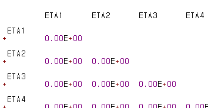
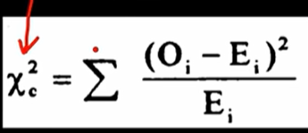

# **NONMEM의 수행 목적과 수행과정**

## Modeling이란?

Model이란 어떤 전체 System(약동학에서는 사람??)을 설명하기 위한 mathematical model를 의미

Model은 실험적으로 구해진 data에서 만들어지는데 data는 input이 system(사람)을 거처 오면서 noise가 생기게 되고, output이 나오고 측정시에 생기는 error등이 합쳐진 값

Data = Systemic Component + Error

\-\> 따라서 Modeling의 목적은 이렇게 생성된 Data에서 Error나 Noise를 구별해 주기 위해서 시행,

System을 거치면서 나오게 된 data를 잘 설명하는 parameter를 찾는 과정

Model에는 structure model을 포함하는데 structure model 안에는 systemic component + statistical model(error)가 존재(필연적으로 존재)

\-\> Modeling 초기에는 systemic component에 초점을 맞추고 이후에 error model를 포함해서 modeling을 수행

Modeling을 통해 그 약물을 설명하는 true model은 찾을 수는 없음 각각의 Modeler별로 해석하는 것이 다르기 때문에 right model은 존재하지 않음, data에 대한 valid interpretation만이 존재 틀린 model은 존재하지 않음

\-\> Modeling은 ‘right model’을 찾는 과정이 아닌 ‘better model’를 찾는 과정

Simulation이란?

Modeling은 기존의 data를 설명하기 위한 수단 이였다면, simulation은 model은 고정하고 input(투여량, etc)등을 바꿔서 수행하는 과정을 말함

\-\>Simulation은 steady-state에 대한 여러가지 maintenance, loading dose에 대한 평가 수단을 제공

Simulation의 방법으로 크게 Deterministic/Stochastic(Monte-Carlo) 2가지 방법이 존재

Deterministic Simulation은 simulation내에서 random component가 없기 때문에 매번 같은 simulation 결과값을 가지는 반면에 Stochastic Simulation의 경우 simulation내에 random component가 존재하기 때문에 simulation마다 서로 다른 결과값을 가짐

NONMEM으로 \$SIM 구문으로 simulation 수행이 가능하지만 R package인 ‘rxode2’, ‘nonmemr2x’를 이용하면 NONMEM의 output file을 가지고 쉽게 simulation이 가능

Rxode2 package는 stochastic simulation을 수행하는 R packages

Monte-Carlo simulation -\> 중복되지 않고, 독립적인 random number를 만들어서 simulation

구체적으로 어떤 식으로 random number를 만드는 지는 잘 모르겠음

기존의 만들어진 Model에서 추정된 THETA, OMEGA, SIGMA값을 모두 고정하고 simulation함

Parameter의 경우 평균이 THETA이고 분산2이 OMEGA인 정규분포를 따른다고 가정

**-\> 각 Simulation별로 위의 분포를 만족하는 data가 만들어지게됨**

## NONMEM이란?

NONMEM

Non-Linear Mixed Effect Model로 일반 비선형 회귀 모델을 데이터에 맞추도록 설계하는 컴퓨터 프로그램, 일반적으로 biological system은 일반적으로 non-linear

\-\>일반적으로 Linear인 경우 다른 parameter에 상관없이 일정하게 도함수가 유지되어 직선의 형태를 가지지만 Non-Linear인 경우 다른 parameter에 따라 도함수가 변하게 되어 직선의 형태를 가지지 않게됨

NONMEM의 수행과정

Initialization -\> Estimation step -\> Covariance step -\> Table step : 4단계로 구성

NONMEM을 사용하는 목적

\-\> population pk analysis를 위해, Cl, K 등과 같은 parameter의 추정값의 조합을 찾는 것이 목적

여러 방법에 따라 THETA 값들을 estimation하게 됨

\-\> ELS(Extended Least Square)을 이용한 objective function value의 도출, OFV의 차이를 평가하기 위해서 LRT를 사용함

여기서 Likelihood라는 개념이 나오는데 예를 들어 어떠한 Model이 참이라고 가정하였을 때, Observation data(Model + ERROR)이 가장 높게 나타날 가능성(잔차를 회소화)을 가진 함수를 찾는 것을 의미, 함수는 정규분포의 확률밀도함수의 형태를 가진 목적함수(Objective function)를 사용

\-\> 목적함수를 간단히 하기 위해서 -2log(X)를 하므로 이 Likelihood를 가장 높이는 것은 -2log(X)를 가장 낮추는 것을 의미함

\-\> 따라서 Objecitve Function에서 도출된 Objective Function Value(OFV)를 최소화하는 Model를 찾는 것이 NONMEM를 사용하는 목적

목적함수를 그래프로 그렸을 때 최소인 점은 극값(도함수 = 0인 x값, local minima)을 말하는데 극값이 여러 개 인 경우 찾은 극값이 최소값이 아닐수도 있다 -\> 초기 추정치는 Initial Estimate(IE)를 잘 설정하는 것이 매우 중요

\-\> NONMEM을 돌리는 과정(cmd 창)에서 각 iteration이 gradient=0이라는 뜻은 미분값이 0이여서 가장 낮은 값을 찾은 상태를 의미: ERROR를 의미함

DATA FRAME

반드시 Dosing 정보와 TIME = 0에서의 data를 기입해주어야함

\-\> Dosing이 0(Vehicle)인 경우 0 대신에 0.00001을 기입해주어서 NONMEM의 오류를 방지

MDV값의 처리

\-\> MDV는 결측치를 나타내주는 data로 값이 BQL이거나 excel 파일상에서 OBS값이 없는 경우 1로 처리를 함

\-\> IV인 경우 time = 0인 부분에 0이라고 쓰여져 있는 경우에 1로 처리할 것(상식적으로 측정이 불가능하기 때문에 )DV에 “ . ” 으로 처리하고 MDV값을 1로 처리 해야함, 반대로 PO인 경우 excel에 TIME =0 인 부분에 0으로 기입되어 있으면 관찰값으로 인정하고 MDV를 0으로 처리

Dosing이 서로 다를 경우 나중에 VPC 그리기 편하기 하게 위해서 Dosing column을 만들어서 처리

CTL FILE

NONMEM을 수행하기 위해서는 NM TRAN에 Data File과 CTL File이 필요 NONMEM은 이 두가지 파일을 가지고 Modeling를 수행하게 되고 최종 결과물로 parameter 값들과 .out File을 생성 ADVAN, OMEGA, THETA, SIGMA 등등의 값들을 결정하게 됨

ADVAN

ADVAN을 설정하는 것에 있어서 compartment를 먼저 결정해야 되는데 먼저 data file에서 시간 – 농도 그래프를 그려서 compartment의 개수를 설정

\-\> 몇몇의 ID가 다수의 ID와 다르게 compartment 개수가 많게 되면 compartment 개수는 compartment 수가 많은 것을 택함

Initial Estimate(IE) 초기값의 설정

초기값을 잘 설정함으로써 NONMEM이 Estimation의 횟수(iteration)를 줄이게 됨으로써 반복되는 계산 횟수를 줄여 수행 시간이 단축

\-\> 초기값은 NCA 분석하듯이 미리 값(AUC, CL)을 도출해보고 초기값을 설정

\-\> 초기값을 잘 설정하지 않으면 ERROR가 나오거나 Out of boundary로 제대로 된 값이 나오지 않을 수가 있음

\$OMEGA의 처리

행렬로 표현

\$OMEGA \$OMEGA DIAGONAL(2)

0.01 0.01

0.2 0.2

\-\> 두개는 서로 같은 표현을 의미: η1, η2 간의 covariance를 0이라고 가정 = 서로 상관관계가 존재하지 않고 독립적인 관계

DIAGONAL은 서로 대각선 방향에 있는 수를 제외한 행렬의 나머지 부분를 “0”으로 처리

\$OMEGA BLOCK(2)

0.01

0.04 0.2

\-\> OMEGA BLOCK η1, η2 간의 covariance를 0.04로 가정

Validation

Goodness of Fit

OFV인 L값이 정규분포 식들이

보통 그래프로 표현하거나 R2와 같은 결정계수(Coefficient of determination)으로 표현

카이제곱검정을 이용해서 Model를 validation함

수집한 데이터의 variance가 과연 우연인지 아니면 내가 test한 variable에 의한 것인지를 판정하기 위해 사용

카이제곱 = 합을 할 건데 (관찰 – 예측)\^2/ 예측

Null hypothesis : 관찰 – 예측된 값이 서로 통계적으로 무의미

\-\> 카이제곱검정은 위의 hypothesis를 기각할지 용인할지를 정량적으로 계산해줌

자유도는 나올 수 있는 결과값이 n개이면 n-1으로 결정

카이제곱 table에서 자유도의 차이는 비교하려는 두 모델간의 parameter 개수의 차이를 의미

\-\> 반드시 nested model( = 같은 모델이라고 생각하자) 사이의 비교를 해야함

**ex) 단순히 2-comp, 3-comp 간의 OFV 값을 보고 낮은 model이 적합하다고 생각하지 말아야함**

Critical value는 0.05만을 사용 -\> 기각을 하든 용인을 하든 신뢰도가 95%를 의미

\-3.84이상이 되면 hypothesis를 기각하므로 prediction값이 통계적으로 유의미

PK -PD Modeling

PD를 PK와 어떻게 연결을 할 것인지(SIM, PPP PPP&D, IPP)

PD에 지연이 있는지

PD는 무슨 모델이 있는지

\-\> 다음과 같은 3가지를 어떻게 처리를 할 것인지를 확인

# NONMEM 

## Mixed-effects modeling
- 기존의 분석 방법으로는 실제 관계나 왜곡되거나 sample의 갯수의 한계로 인해 고안됨 방법으로 population mean을 구하고 각각의 sample의 관계를 잔차(OMEGA, SIGMA)로 보정하는 방법

## DATASET 
- IGNORE = @가 되지 않을 경우에 ID 앞에 #을 붙이고 IGNORE= #(#뒤의 문자열을 모두 무시)으로 대체해보자
- bootstrap시에 ID가 1,2,3,4 이런식이 아니면 오류가 나는듯? -> 1,2,3,4 처럼 단순하게 바뀌서 수행하자 
- Scaling factor는 Central compartment로 맞춘다 
- RATE: Zero-order로 modeling하는 경우 -2라 기입, first-order & zero-order로 혼합한 경우 각각의 dosing 정보를 기입해야함(하나는 . 하나는 -2),용량은 기존의 dose랑 같게 -> F1,F2와 같은 parameter등으로 자동으로 계산하는듯?

## 제어구문 
- $PRED 부분에는 modeling의 기본적인 정보를 기입해놓자 pirana에서는 PROB뒷부분이 표시됨 이외의 정보는 ;;에 기입
- $DATA test.csv IGNORE=# IGNORE=(WEIGHT.LE.40, SEX.EQ.1) 다음과 같이도 쓸 수 있으니 혹시 사용할때 참고해볼것
- $INPUT 사용하고 싶지 않는 column의 경우에는  = DROP 기입, 만약에 CON이 DV column과 같은 것이라면 CON=DV 이런식으로도 기입 가능한듯?
- $COVARIANCE만 작성해도 Standard error가 출력이 됨
- $ESTIMATION은 NOABORT MAXEVAL=9999 METHOD=1 INTER PRINT=10 SIGDIGITS=3 이 옵션을 고정해서 사용하자 
- $DES에 zero-order 사용할 시에 F1 D1와 같은 파라미터 기입하지 말고 그냥 정맥주사처럼 취급, $PK에 parameter만 기입해놓고 estimation하게 만들면 알아서 계산하는듯?
- Oral이랑 IV 두 개를 같이 modeling하는 경우 F를 추정하는 듯?
- CMT를 사용용

